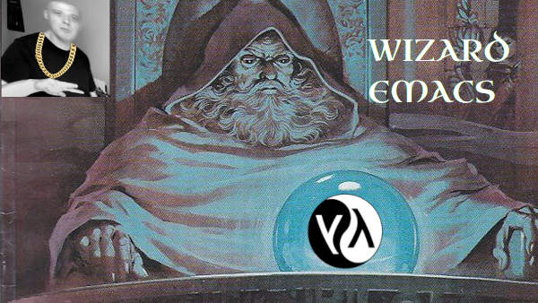

# WIZARD EMACS

---

### Shadow Money Wizard Gang, we love casting spells, and love dewm emacks

A config setup for wizards using doom emacs.

## Features of Wizard Emacs

- Epic Wizard Dashboard screen

- Skyrim quest sound effects for org todo item completion

## Things to note

- I am using the Monoid Retina Nerd Font: [Link to example](https://www.programmingfonts.org/#monoid), so you need this otherwise your init will fail. You can change that if you want.
